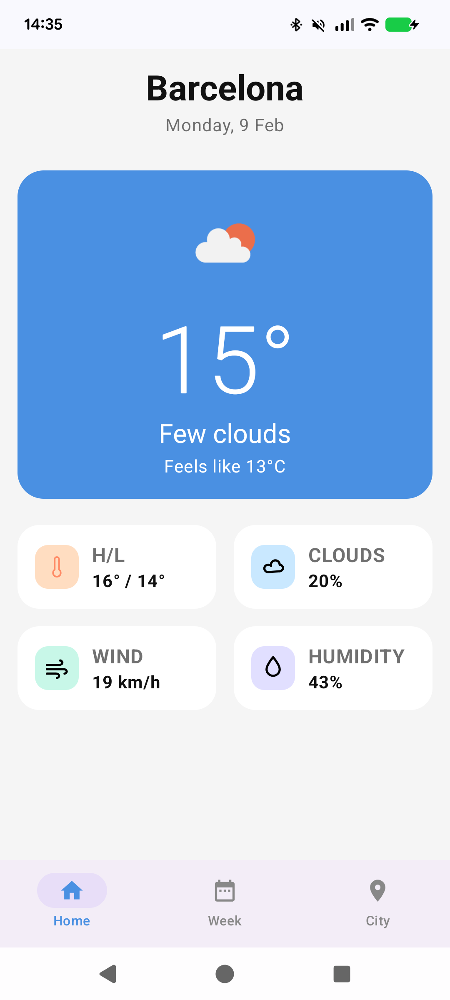
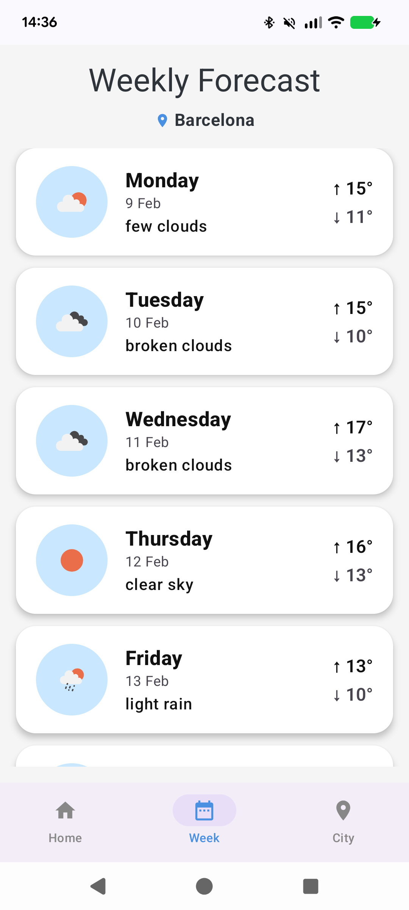

# Weather Demo 🌤️

A sample Android weather application built using modern Android development tools and best practices.

The app consumes real-time data from the OpenWeatherMap API and presents it through a fully Jetpack Compose–based UI, following a clean MVVM architecture with a dedicated domain layer. It leverages Kotlin Coroutines, Flow, and the Navigation 3 API.

---

## Screenshots

| Home | Weekly Forecast | City Search |
|------|----------------|-------------|
|  |  |  |

---

## Features

- Display current weather based on the user’s location
- Weekly weather forecast
- Search weather information by city
- Metric units and English language support
- Local persistence of the selected city
- Fully Compose-based UI
- Navigation implemented using the Navigation 3 API

---

## Setup

To run the project, create a `local.properties` file in the root directory and add your OpenWeatherMap API key:

```properties
OPEN_WEATHER_API_KEY=YOUR_API_KEY
```

You can obtain an API key from the OpenWeatherMap website:  
https://openweathermap.org/api

---

## App Overview

The application consists of three main screens:

### 1. Home  
Displays the current weather and temperature using the device’s coordinates or the selected city.

### 2. Weekly Forecast  
Shows the weather forecast for the upcoming days.

### 3. City Search  
Allows users to search for a city and view its weather information.

---

## Architecture and Project Structure

The project follows a modularized MVVM architecture with a dedicated domain layer and is divided into the following modules:

### :app

Main application module, responsible for application setup and dependency injection.

- Owns the global navigation entry point  
- Defines the start destination  
- Acts as the composition root  

This structure makes it easy to integrate additional features in the future (e.g. `feature-settings`, `feature-profile`).

---

### :core-data

Contains:

- API definitions  
- Remote and local data sources  
- DataStore persistence  
- DTOs  
- Repository implementation  

---

### :core-domain

Contains:

- Use cases  
- Domain models  
- Business logic  

The domain layer sits between the presentation layer and the data layer, ensuring proper separation of concerns and improving testability.

Each ViewModel interacts with the system exclusively through use cases, keeping business rules independent from Android framework classes.

---

### :feature-weather

Includes:

- All Compose UI screens  
- Navigation graph for the feature  
- ViewModels  

Since the Weather feature is self-contained, internal navigation (Home, City Search, Weekly Forecast) is handled inside `:feature-weather`, while global orchestration remains in `:app`.

This structure keeps the project scalable and aligned with Clean Architecture principles without unnecessary over-modularization.

---

## Technical Decisions

### MVVM + Domain Layer

MVVM was chosen to clearly separate UI logic from business logic.

A dedicated domain layer with use cases was introduced to:

- Encapsulate business rules  
- Improve testability  
- Decouple the presentation layer from the data layer  
- Align the project with Clean Architecture principles  

Although the application scope is relatively small, structuring it this way demonstrates how the project could scale in a real production environment.

---

### Jetpack Compose

The UI is built entirely with Jetpack Compose to leverage a modern, declarative approach and reduce boilerplate compared to XML-based layouts.

---

### Navigation 3

Navigation is implemented using the Navigation 3 API for Jetpack Compose, allowing a more flexible and type-safe navigation approach.

---

### Coroutines and Flow

Coroutines and Flow are used to handle asynchronous operations and data streams in a concise and lifecycle-aware manner.

---

### Dependency Injection

Dagger Hilt is used for dependency injection, ensuring proper separation of concerns and simplifying testability.

---

### DataStore for Local Persistence

DataStore is used instead of SharedPreferences for safer, asynchronous, and more modern data persistence.

---

## API

The application uses the OpenWeatherMap API.

### Endpoints used:

- `GET data/2.5/weather`  
  Retrieves current weather data by coordinates.

- `GET data/2.5/forecast`  
  Retrieves the weather forecast.

- `GET geo/1.0/direct`  
  Searches for cities by name.

API configuration is defined in `WeatherApiConfig.kt`:

```kotlin
const val UNITS = "metric"
const val LANG = "en"
```

---

## Tech Stack

- Kotlin  
- Jetpack Compose  
- Navigation 3  
- Coroutines and Flow  
- Dagger Hilt  
- Retrofit  
- DataStore  
- Coil  
- JUnit  
- Mockito  

---

## Acknowledgements

This application was developed with the help of Stitch for UI design, as well as ChatGPT, Gemini, and the Android Studio agent.
