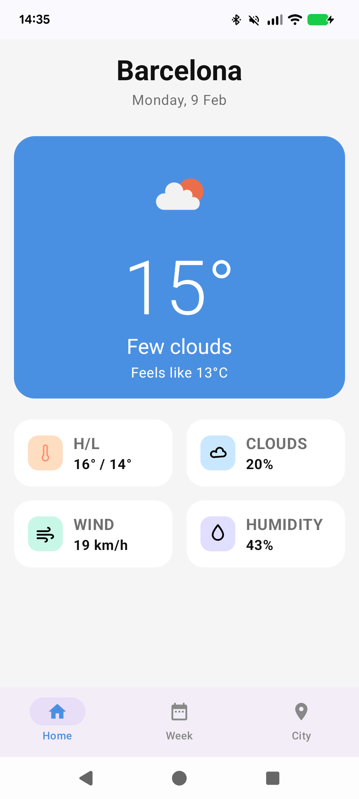
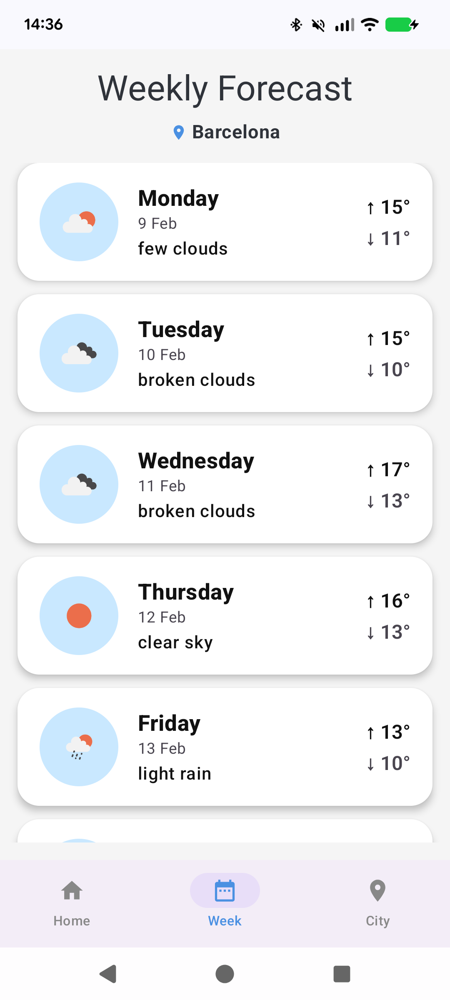
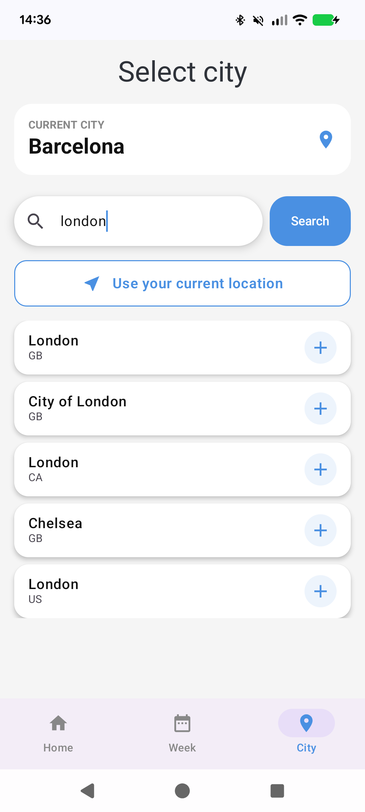

# Weather Demo 🌤️

A sample Android weather application built using modern Android development tools and best practices.

The app consumes real-time data from the OpenWeatherMap API and presents it through a fully Jetpack Compose–based UI, following an MVVM architecture and leveraging Kotlin Coroutines, Flow, and Navigation 3 API.

---

## Screenshots

| Home | Weekly Forecast | City Search |
|------|----------------|-------------|
|  |  |  |

---

## Features

- Display current weather based on the user’s location
- Weekly weather forecast
- Search weather information by city
- Metric units and English language support
- Local persistence of the selected city
- Fully Compose-based UI
- Navigation implemented using the new Navigation 3 API

---

## Setup

To run the project, create a local.properties file in the root directory and add your OpenWeatherMap API key:

```properties
OPEN_WEATHER_API_KEY=YOUR_API_KEY
```

You can obtain an API key from the OpenWeatherMap website:
https://openweathermap.org/api

---

## App Overview

The application consists of three main screens:

1. Home  
   Displays the current weather and temperature using the device’s coordinates or the selected city.**

2. Weekly Forecast  
   Shows the weather forecast for the upcoming days.

3. City Search  
   Allows users to search for a city and view its weather information.

---

## Architecture and Project Structure

The project follows the MVVM (Model–View–ViewModel) architecture and is divided into the following modules:

- :app  
  Main application module, responsible for application setup.

- :core  
  Contains API definitions, data sources, local persistence (city), and the repository.

- :feature-weather  
  Includes all UI screens, navigation and their corresponding ViewModels.

To keep the project simple and avoid over-engineering, a single repository is used directly by the ViewModels, without an additional UseCase layer.
For the same reason, the project is not split into more modules.

---

## Technical Decisions

- **MVVM Architecture**  
  MVVM was chosen to clearly separate UI logic from business logic and to improve testability and maintainability.

- **Single Repository Pattern**  
  A single repository is used and accessed directly by the ViewModels.  
  Given the limited scope of the application, introducing an additional UseCase layer was considered unnecessary and would have added complexity without clear benefits.

- **Jetpack Compose**  
  The UI is built entirely with Jetpack Compose to leverage a modern, declarative UI approach and reduce boilerplate compared to XML-based layouts.

- **Navigation 3**  
  Navigation is implemented using Navigation 3 API for Jetpack Compose, allowing a more flexible and type-safe navigation approach compared to the previous Navigation Compose APIs.

- **Coroutines and Flow**  
  Coroutines and Flow are used to handle asynchronous operations and data streams in a concise and lifecycle-aware manner.

- **DataStore for Local Persistence**  
  DataStore is used instead of SharedPreferences for safer and more modern data persistence.

---

## API

The application uses the OpenWeatherMap API.

Endpoints used:

- GET data/2.5/weather  
  Retrieves current weather data by coordinates.

- GET data/2.5/forecast  
  Retrieves the weather forecast.

- GET geo/1.0/direct  
  Searches for cities by name.

API configuration is defined in WeatherApiConfig.kt:

```kotlin
const val UNITS = "metric"
const val LANG = "en"
```

---

## Tech Stack

- Kotlin
- Jetpack Compose
- Navigation 3
- Coroutines and Flow
- Dagger Hilt
- Retrofit
- DataStore
- Coil
- JUnit and Mockito


---

This application was developed with the help of Stitch for UI design, as well as ChatGPT, Gemini, and the Android Studio agent.
